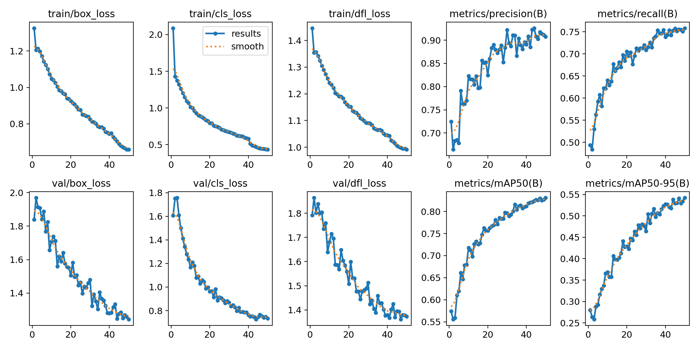

#  AI-Based PPE Detection System

##  Project Overview

This project is an **AI-based workplace safety system** that uses **computer vision** and **deep learning** to detect personal protective equipment (**PPE**) in real time. It helps monitor whether workers are wearing safety gear properly, such as **hard hats, masks, safety vests, cones**, and also detects **machinery, vehicles, and people** on construction, industrial, or warehouse sites.

**Key Features:**
- Real-time detection and classification using **YOLOv8**
- Visual compliance feedback with color-coded bounding boxes  
  - 🟢 **Green** → Compliance  
  - 🔴 **Red** → Non-compliance
- High precision, recall, and mAP scores
- Scalable and adaptable for different worksites
- Helps reduce accidents and improve overall safety compliance

---

##  Dataset

- **Construction Site Safety Object Detection Dataset**
- Downloaded from [Roboflow](https://roboflow.com/)

---

##  Model Training

**Environment:** Google Colab  
**Framework:** [Ultralytics YOLOv8](https://docs.ultralytics.com/)

Below is an example snippet used for training the model:

```python
from ultralytics import YOLO

# Load pre-trained YOLOv8s model and train
model = YOLO('yolov8s.pt')
results = model.train(
    data="/content/drive/MyDrive/ppe3/data.yaml",
    epochs=50,
    imgsz=640
)
```
##  How It Works

- The YOLOv8 model is trained on a custom PPE dataset.
- The best trained weights (`best.pt`) are saved.
- Real-time detection is implemented locally using **OpenCV**.
- The webcam captures live video; each frame is analyzed to detect safety gear.
- Bounding boxes indicate compliance:
  - 🟢 **Green** → Compliant
  - 🔴 **Red** → Non-compliant

---

##  Note

- The **trained weights (`best.pt`)** and **`data.yaml`** are not uploaded to this repository.
- To run detection locally, make sure to update the file paths to your own trained weights.
- Install required libraries:

  ```bash
  pip install ultralytics opencv-python cvzone
  ```
## Achievements

- High accuracy with strong precision and recall.
- Effective convergence as shown in training and validation loss curves.
- Consistent detection performance in real-time testing.



## Real-Time Detection 

Watch the real-time detection output here:

[](https://youtu.be/KL71hhqhj3g)
